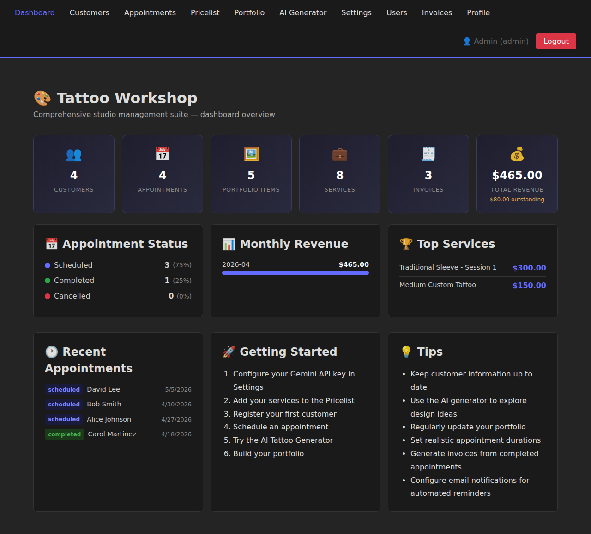
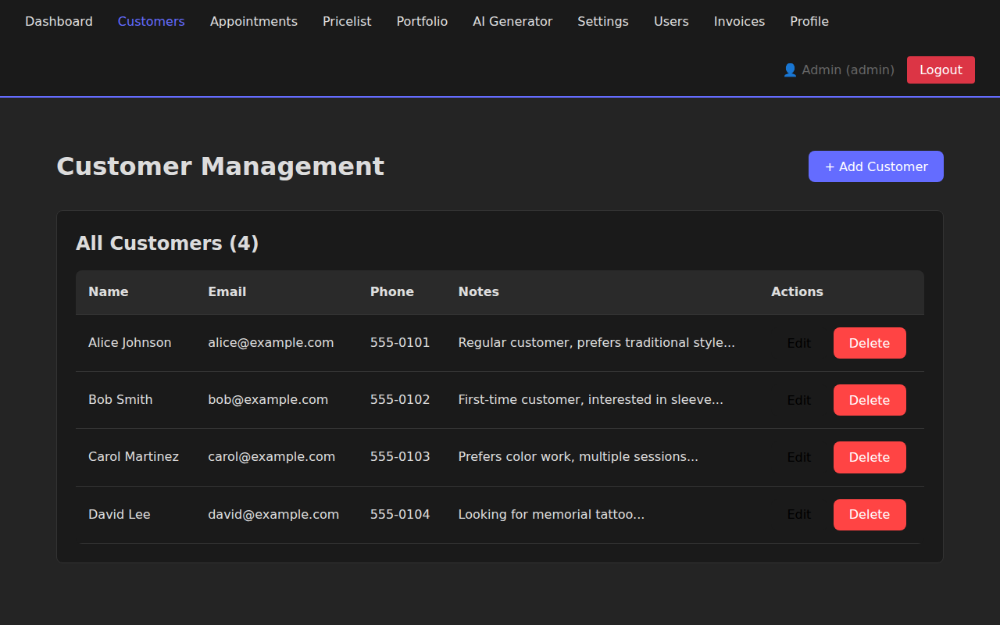
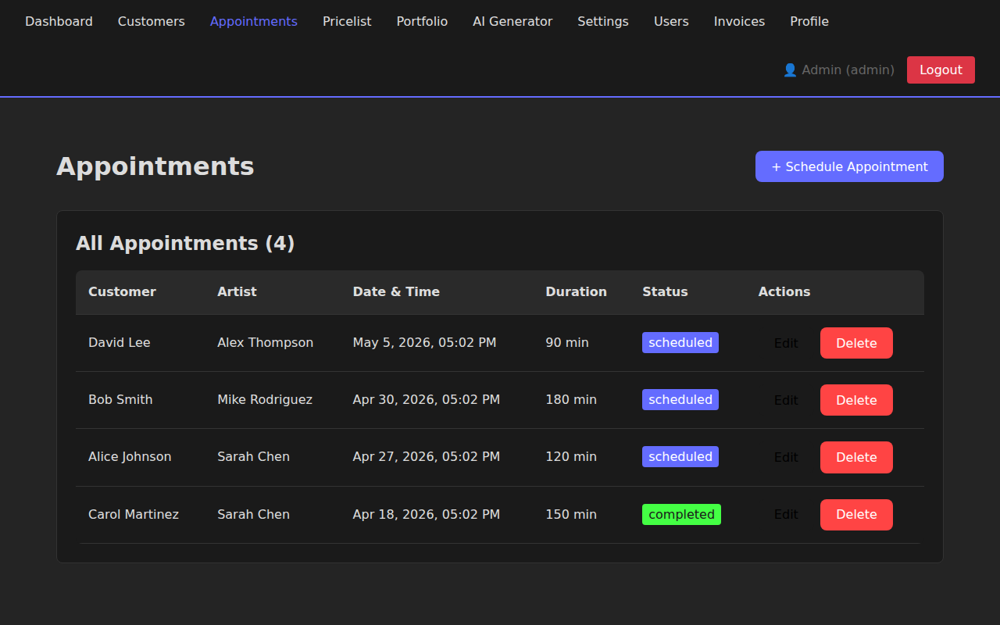
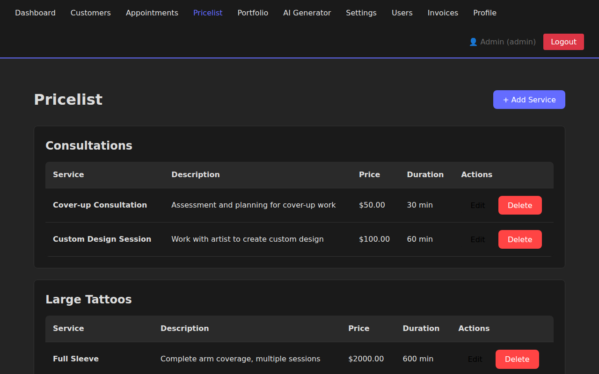
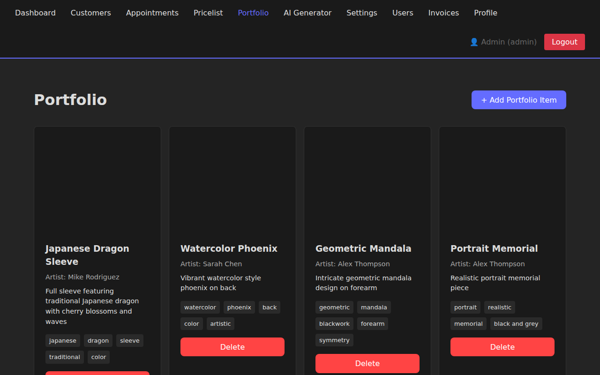
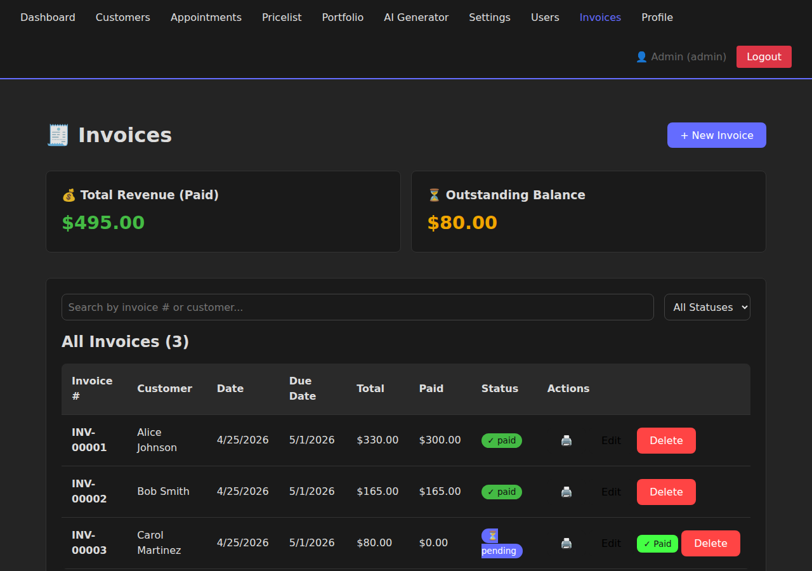
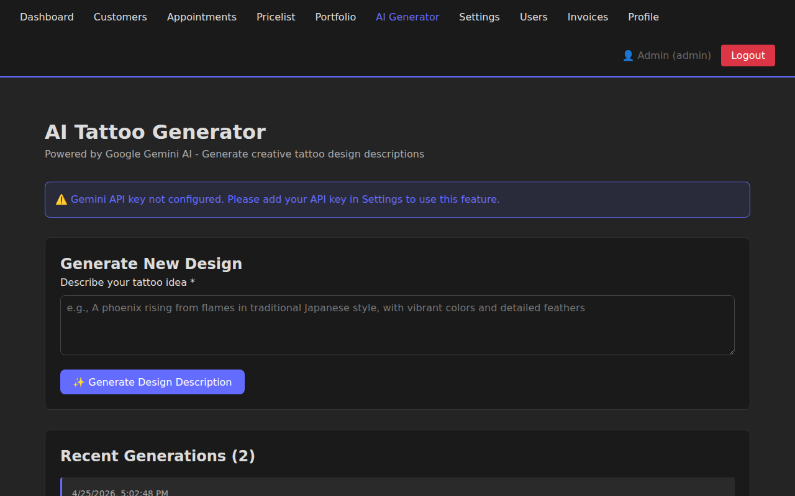
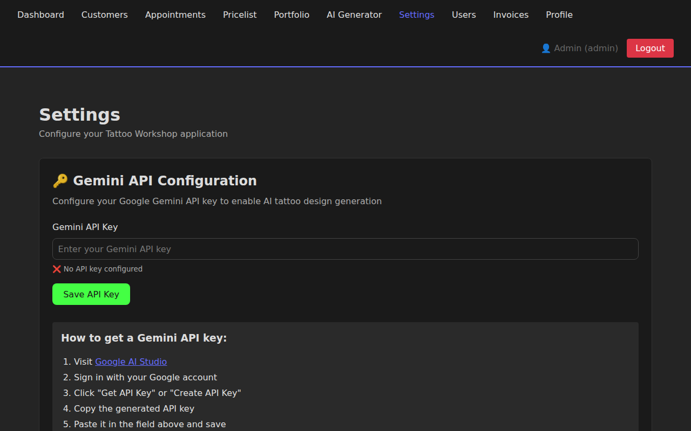
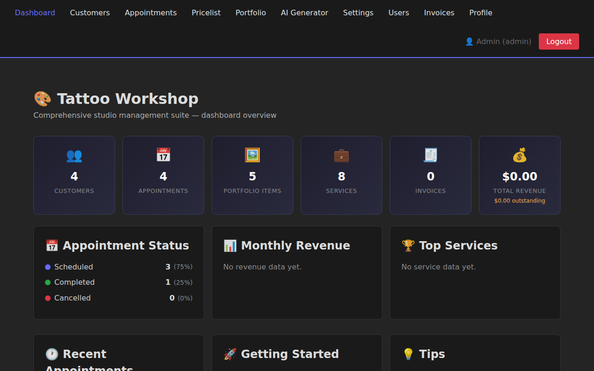

# Tattoo Workshop 🎨

[](https://github.com/GizzZmo/Tattoo-Workshop/actions/workflows/ci-cd.yml)
[](https://nodejs.org/)
[](LICENSE)
[](package.json)

A comprehensive studio management suite for tattoo artists and studios, featuring AI-powered design generation, customer management, appointment scheduling, invoicing, and more.

## Screenshots 📸

| Dashboard | Customers | Appointments |
|-----------|-----------|--------------|
|  |  |  |

| Pricelist | Portfolio | Invoices |
|-----------|-----------|----------|
|  |  |  |

| AI Generator | Settings | Login |
|--------------|----------|-------|
|  |  |  |

## Features ✨

- **🔐 User Authentication**: Secure login system with JWT tokens and role-based access control
- **👥 Multi-User Support**: Admin, Artist, and Receptionist roles with different permission levels
- **🤖 AI Tattoo Generator**: Generate detailed tattoo design descriptions using Google Gemini AI
- **👥 Customer Management**: Secure customer database with contact information and notes
- **📅 Appointment Scheduling**: Track appointments with customers, artists, and status updates
- **📧 Email Notifications**: Automated appointment confirmations, reminders, and updates
- **💰 Dynamic Pricelist**: Manage services with categories, pricing, and duration estimates
- **🖼️ Portfolio Gallery**: Showcase your work with images, descriptions, and tags
- **🧾 Invoice Management**: Professional invoices with line items, tax, and payment tracking
- **📊 Analytics Dashboard**: Revenue summary, appointment stats, monthly revenue, and top services
- **⚙️ Settings Management**: Configure API keys and application preferences
- **🔒 Secure Local Storage**: All data stored locally using SQLite database

## Tech Stack 🛠️

- **Frontend**: React 18 + Vite
- **Backend**: Node.js + Express
- **Database**: SQLite (better-sqlite3)
- **Email**: Nodemailer
- **AI Integration**: Google Gemini API
- **Styling**: Custom CSS with responsive design
- **Routing**: React Router v6

## Installation 📦

### Prerequisites

- Node.js 18.x or higher
- npm or yarn

### Quick Start

See [QUICKSTART.md](QUICKSTART.md) for a rapid getting-started guide.

### Setup Steps

1. **Clone the repository**
   ```bash
   git clone https://github.com/GizzZmo/Tattoo-Workshop.git
   cd Tattoo-Workshop
   ```

2. **Install dependencies**
   ```bash
   npm install
   ```

3. **Start the development server**
   ```bash
   npm run dev
   ```

   This will start both the backend server (port 3001) and frontend dev server (port 3000).

4. **Access the application**
   - Open your browser and navigate to `http://localhost:3000`
   - The backend API runs on `http://localhost:3001`

5. **(Optional) Add sample data**
   ```bash
   npm run seed
   ```

For detailed installation instructions, see [INSTALLATION.md](INSTALLATION.md).

## Configuration ⚙️

### Gemini API Key

To use the AI Tattoo Generator feature:

1. Visit [Google AI Studio](https://makersuite.google.com/app/apikey)
2. Sign in with your Google account
3. Create a new API key
4. In the application, navigate to **Settings**
5. Enter your API key and save

### Email Notifications (Optional)

To enable email notifications for appointments:

1. Configure SMTP settings via the API or Settings page
2. Supported providers: Gmail, SendGrid, Mailgun, Office 365, etc.
3. Enable appointment confirmations and reminders
4. For detailed setup instructions, see [EMAIL-NOTIFICATIONS.md](EMAIL-NOTIFICATIONS.md)

## Usage Guide 📖

### Dashboard
The dashboard provides an overview of your studio statistics and quick access to all features.

### Customer Management
- Add, edit, and delete customer records
- Store contact information, addresses, and custom notes
- Search and filter customers

### Appointments
- Schedule appointments with specific customers
- Assign artists to appointments
- Set duration and add notes
- Track appointment status (scheduled, completed, cancelled)
- Receive email confirmations and reminders automatically

### Pricelist
- Create service categories
- Add services with pricing and estimated duration
- Edit and organize your offerings

### Portfolio
- Add images of your work
- Include descriptions and artist information
- Tag pieces with relevant keywords
- Organize and showcase your best work

### Invoices
- Create professional invoices linked to customers and appointments
- Add line items with quantity and unit pricing
- Apply tax rates and track deposits
- Track payment status (pending, partial, paid, cancelled)
- Mark invoices as paid with one click
- Print / save as PDF via browser print dialog

### AI Tattoo Generator
- Enter detailed descriptions of tattoo ideas
- Receive professional design recommendations
- Get style suggestions and placement advice
- View generation history

## Development 💻

### Available Scripts

- `npm run dev` - Start both frontend and backend in development mode
- `npm run dev:client` - Start only the frontend dev server
- `npm run dev:server` - Start only the backend server
- `npm run build` - Build the application for production
- `npm run preview` - Preview the production build
- `npm run lint` - Run ESLint
- `npm run seed` - Populate database with sample data

### Project Structure

```
Tattoo-Workshop/
├── .github/
│   └── workflows/
│       └── ci-cd.yml          # GitHub Actions workflow
├── docs/
│   └── screenshots/           # Application screenshots
├── public/
│   └── tattoo-icon.svg        # Application icon
├── server/
│   ├── auth/
│   │   ├── middleware.js      # Auth middleware
│   │   ├── routes.js          # Auth routes (login, register, profile)
│   │   └── utils.js           # Auth utilities (hashing, JWT)
│   ├── email/
│   │   ├── service.js         # Email sending service
│   │   ├── scheduler.js       # Email reminder scheduler
│   │   └── templates.js       # Email templates
│   ├── migrations/            # Database migrations
│   └── index.js               # Express server and API routes
├── src/
│   ├── components/
│   │   ├── ImageCapture.jsx   # Camera/image capture component
│   │   └── ProtectedRoute.jsx # Auth-protected route wrapper
│   ├── contexts/
│   │   └── AuthContext.jsx    # Authentication context
│   ├── pages/
│   │   ├── Dashboard.jsx      # Analytics dashboard
│   │   ├── Customers.jsx      # Customer management
│   │   ├── Appointments.jsx   # Appointment scheduling
│   │   ├── Pricelist.jsx      # Service pricing
│   │   ├── Portfolio.jsx      # Portfolio gallery
│   │   ├── TattooGenerator.jsx # AI generator
│   │   ├── Invoices.jsx       # Invoice management
│   │   ├── Profile.jsx        # User profile
│   │   ├── UserManagement.jsx # Admin user management
│   │   └── Settings.jsx       # Settings page
│   ├── styles/
│   │   └── App.css           # Global styles
│   ├── App.jsx               # Main app component
│   └── main.jsx              # Entry point
├── scripts/
│   └── seed-data.js          # Database seeding script
├── dist/                     # Production build artifacts (generated)
├── .eslintrc.cjs             # ESLint configuration
├── .gitignore                # Git ignore rules
├── index.html                # HTML template
├── package.json              # Dependencies and scripts
├── vite.config.js            # Vite configuration
└── README.md                 # This file
```

## GitHub Actions Workflow 🔄

The project includes a CI/CD pipeline that:

- ✅ Runs on push to main/develop branches and pull requests
- ✅ Tests against multiple Node.js versions (18.x, 20.x)
- ✅ Installs dependencies and runs linting
- ✅ Builds the application
- ✅ Uploads build artifacts
- ✅ Deploys to GitHub Pages on main branch

## Security & Privacy 🔒

- All customer data is stored locally in a SQLite database
- API keys are stored securely and only used for AI requests
- No data is shared with third parties except Google AI for design generation
- Regular database backups are recommended

## Contributing 🤝

Contributions are welcome! Please read [CONTRIBUTING.md](CONTRIBUTING.md) for details on our code of conduct and the process for submitting pull requests.

1. Fork the repository
2. Create a feature branch (`git checkout -b feature/AmazingFeature`)
3. Commit your changes (`git commit -m 'Add some AmazingFeature'`)
4. Push to the branch (`git push origin feature/AmazingFeature`)
5. Open a Pull Request

## Documentation 📚

For a complete documentation index and navigation guide, see [DOCUMENTATION.md](DOCUMENTATION.md).

- [README.md](README.md) - This file, general overview
- [ABOUT.md](ABOUT.md) - Project overview, mission, and architecture
- [QUICKSTART.md](QUICKSTART.md) - Get started quickly
- [INSTALLATION.md](INSTALLATION.md) - Detailed installation guide
- [API.md](API.md) - Complete API documentation
- [EMAIL-NOTIFICATIONS.md](EMAIL-NOTIFICATIONS.md) - Email notification system guide
- [ROADMAP.md](ROADMAP.md) - Detailed product roadmap and planned features
- [CONTRIBUTING.md](CONTRIBUTING.md) - Contribution guidelines
- [PROJECT-SUMMARY.md](PROJECT-SUMMARY.md) - Complete project summary
- [DOCUMENTATION.md](DOCUMENTATION.md) - Documentation index and navigation

## License 📄

This project is open source and available under the MIT License.

## Support 💬

For issues, questions, or suggestions:
- Open an issue on GitHub
- Check existing documentation
- Review the code comments

## Roadmap 🗺️

Future enhancements planned:
- ✅ Email notifications for appointments (COMPLETED)
- ✅ Invoice generation (COMPLETED)
- ✅ Analytics dashboard (COMPLETED)
- Cloud backup integration
- Mobile app version
- Advanced reporting and analytics
- Integration with payment processors
- Booking widget for website integration
- SMS notifications
- Multi-language support

For detailed information about each planned feature, including priorities, technical considerations, and benefits, see [ROADMAP.md](ROADMAP.md).

## Acknowledgments 🙏

- Google Gemini AI for powering the design generator
- React and Vite communities
- All contributors and users

---

Built with ❤️ for tattoo artists and studios
